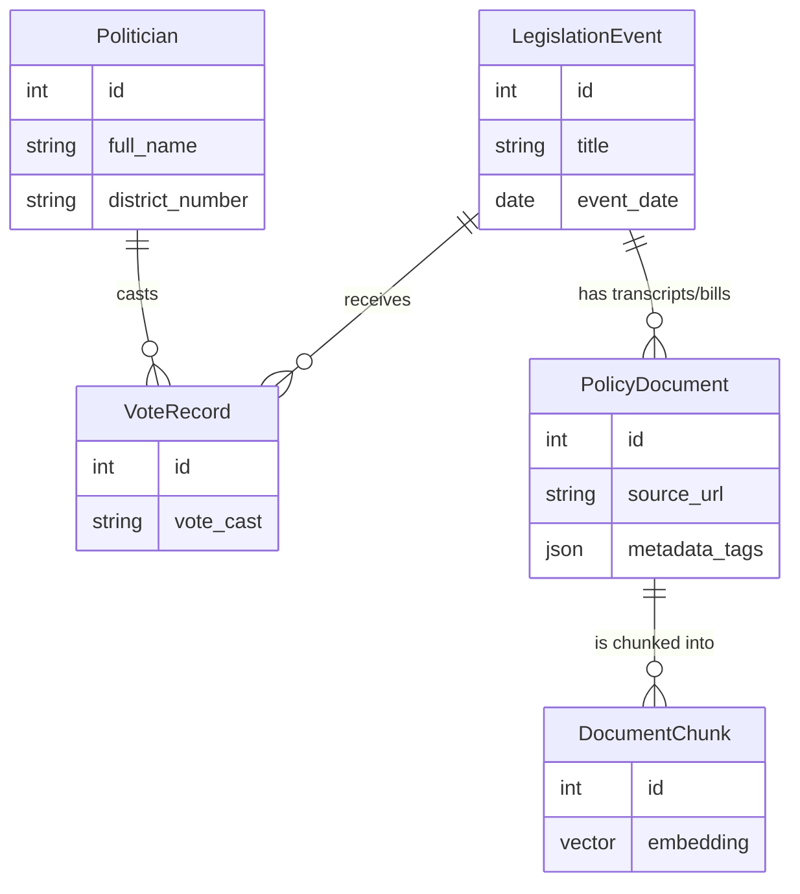

# Database Architecture 

The central pillar of Civic Spiegel is the ability to securely and seamlessly map politicians, policies, and semantic context together without a fragmented backend infrastructure.

## Tech Choice: Neon Serverless Postgres
We elected to use a Neon Postgres database instead of a dedicated NoSQL document store (like MongoDB) or a dedicated Vector store (like Pinecone/Chroma). 
*   **Why?** Using the `pgvector` Postgres extension allows us to maintain the strict referential integrity of standard SQL (e.g., tying `Politician` IDs to `VoteRecord` IDs), while simultaneously storing 384-dimension vector embeddings alongside the text data in the exact same schema. 

## The Schema (SQLModel)
Our schema is defined completely in Python using `SQLModel` (inside `backend/schema.py`). SQLModel marries Pydantic data validation with SQLAlchemy ORM mechanics, meaning we get typing and validation for free on our FastAPI endpoints.

We operate a normalized 5-Table ecosystem:

1. **Politician:** Name, party affiliation, district, URL links, and image links.
2. **LegislationEvent:** The core tracking unit for bills or acts (e.g. "Intro 42-A", "Passage of Budget"). Includes the type of event and date.
3. **VoteRecord:** The mapping table between a Politician and a LegislationEvent. Tracks whether they voted "Yea/Nay", or abstained. (Note: Naive mapping here is limited; we contextualize it using RAG).
4. **PolicyDocument:** A comprehensive entity representing scraped HTML/PDF files (e.g., Committee minutes, Press releases, NYT articles). Links back to a LegislationEvent if applicable.
5. **DocumentChunk:** The backbone of the ML pipeline. If a `PolicyDocument` is 2000 words long, we break it into 500-word rows in this table. Each row holds the text chunk AND the `embedding` vector (generated by `FastEmbed`).

## MVP Offline Bypass
Because provisioning Neon requires API keys and organization setup, we have created an offline mock database. When the Python Data Pipeline scraper runs, instead of saving these rows to SQL, it wraps it in a similar JSON structure and outputs `mock_db.json`. 

The Local FastAPI server reads `mock_db.json` into memory as a list of Python dictionaries to prove that the chat models and frontend connections work flawlessly before investing in live hosted infrastructure.

## Visualizing the Schema

Here is how the data flows together for your app:

